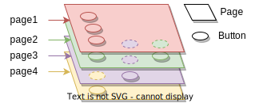
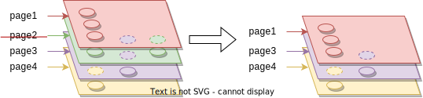
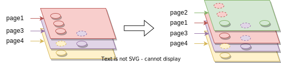
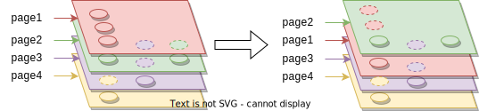

# streamdeck-controller-rs

This application allows to control the displayed image of the buttons of an Elgato StreamDeck Device.
It also receives Button Events from the Streamdeck device and Window focus events
from the Operation System allowing you to run python code when these events occur.

It is a programmable way to configure the StreamDeck. It gives you a lot of flexibility
by allowing you to use python for handling events. You can do basically anything this way, but
it does not come with batteries included. There are no functions for focusing windows or
controlling OBS Studio coming with this application. Luckily python comes with a lot of
libraries which you can use to do these things. See the [examples](#examples) for Ideas, what
you can do in python.

But you can control the buttons of the StreamDeck Device using simple python functions,
see the [Python API](#python-api) for details.

## Installation

## Running & Configuration

When you run the application, it takes only one argument:

```
streamdeck-controller --config config.yaml
```

You have to write the configuration file to setup the behavior of the application.

### Configuration

The following is an example configuration:

```
defaults:
  background_color: "#000000"
on_app:
  - condition:
      executable: ".*terminal.*"
    handler:
      code: |
        print("terminal")
default_pages:
  - page1
buttons:
  - name: example_button
    up_face:
      color: "#FF0000"
      label:
        text: "1"
        color: "#00FF00"
      sublabel:
        text: below
        color: "#0000FF"
    down_handler:
      code: |
        # python stuff
pages:
  - name: main
    buttons:
      - position:
          row: 0
          col: 0
        button: button1
```

We go through the parts of the configuration one by one.

#### Button Faces

A button face defines what is displayed on a button. Within a [Button Setup](#button-setup),
a Button Faces defines what is displayed on a button. A [Button Setup](#button-setup) can define
different faces depending on whether the button is pressed.

```
    up_face:
      color: "#FF0000"
      file: image.png
      label:
        text: "1"
        color: "#00FF00"
      sublabel:
        text: below
        color: "#0000FF"
      superlabel:
        text: above
        color: "#0000FF"
```

The face defines

* `color`: A background color. This can be a hex string as in the example. 
  or on of the other ways to define [colors](colors).
* `file`: A file, which contains an image that is drawn above the background color.
  It may contain an alpha channel.
* `label`: Text, that is writen in the center of the button. Optionally with a color.
* `sublabel`: Text, that is writen in the bottom of the button. Optionally with a color.
* `superlabel`: Text, that is writen in the top of the button. Optionally with a color.

#### Button Setup

A button setup defines the look and behavior of a button.
It used in [pages](#pages) or in [named buttons](#named-buttons) and bound to a position on the stream deck.

It defines:

* `up_face`: The [button face](#button-faces) of the button when it is not pressed.
* `down_face`: The [button face](#button-faces) of the button when it is pressed.
* `down_handler`: Python code to execute when the button is pressed.
* `up_handler`: Python code to execute when the button is released.

#### Pages

Pages, which are defined in the `pages` top level section, are sets of button.
Not every button position of the streamdeck must be defined by a page.

The StreamDeck always displays a stack of pages, where every button displays
the face from the topmost page in the stack, that defines this button. Since pages
can have holes (they don't do not define every button), this must not be the
top page in the stack.

##### Page Layers



In this example the buttons vom page "page3" and "page2" appear on the top, because page 1 does
not define them.

When you remove a page using the [Python API](#python-api) or by defining the
event in the [on app focus event](#on-app-focus-events) of the page, it is removed from the stack no matter on which position
it was located:



When you add a page using the [Python API](#python-api) or by defining the
event in the [on app focus event](#on-app-focus-events) of the page, it is always added to the top
of the stack:



A page can only be once in a stack. If you add an existing page to the stack, it is moved to the top:

]

#### Configuring pages

The pages are configured as a list in the `pages` section of the global configuration:

```
pages:
  - name: main
    on_app:
      conditions:
      - title: ".*Chrome.*"
      remove: true
    buttons:
      - position:
          row: 0
          col: 0
        button: example_button
```

A page has a `name`, that is used when loading and unloading pages from the [Python API](#python-api).

Optionally, it has an `on_app` entry, that contains a list of `conditions` defining that the
page should be loaded when a certain app is getting focus. See [Focus Events](#on-app-focus-events)
for details.

And most importantly, the page defines a list of buttons. That is a [button setup](#button-setup)
and a `position` with the `row` and `col` where the button is located on the streamdeck.
For the `position` the `row` and `col` may be negative, in which case they are counted from the
opposite border of the streamdeck.

The `button` [button setup](#button-setup) can either be:
* A string, in which case it refers to a [named button](#named-buttons).
* A [button-setup](#button-setup) including a `name` property. In this case
  a [named button](#named-buttons) with that `name` is created and added at this position in the page.
  This is the same as adding  the button in [named button])(#named-buttons) section and then
  referring to it as in the first option.
* A complete [button setup](#button-setup), in which case it is not connected to a named button.

#### Named Buttons

In the [pages](#pages) section, we saw that buttons can either be defined directly or
by defined as named buttons. If you define a button as a named button, you can change
it (for example give it a different face) with the [Python API](#python-api).
Every page, that uses that named button will then also change its button.

In a way, the name us used as a reference, by which pages can reference buttons which are
changed globally.

Named buttons can either be defined in [pages](#pages) or in the global `buttons` section:

```
buttons:
  - name: example_button
    up_face:
      color: "#FF0000"
      label:
        text: "1"
        color: "#00FF00"
      sublabel:
        text: below
        color: "#0000FF"
    down_handler:
      code: |
        # python stuff
```

This section is basically a list of [button setups](#button-setup) with names (in the `name` property,
which must exist).

#### Defaults

The `defaults` section defines global defaults for colors. The defaults are used, if they
are not defined within [button faces](#button-faces).

```
defaults:
  background_color: "#000000"
  label_color: "#FFFFFF"
  superlabel_color: "#FF0000"
  sublabel_color:
    red: 255
    green: 0
    blue: 255
```

You can define defaults for:

* `background_color`: The background color of all buttons.
* `label_color`: THe color of the label.
* `sublabel_color`: THe color of the sublabel.
* `superlabel_color`: THe color of the superlabel.

#### Colors

Colors can either be defined as HEX Values, in which case they are a string in yaml, or as 
an object with `red`, `green` and `blue` values between 0 and 255:

```
  superlabel_color: "#FF0000"
  sublabel_color:
    red: 255
    green: 0
    blue: 255
```

#### On App Focus Events

#### Python API

## Examples